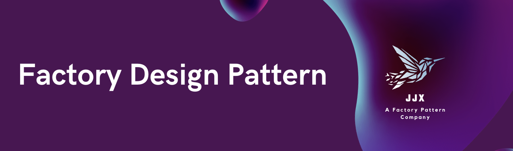
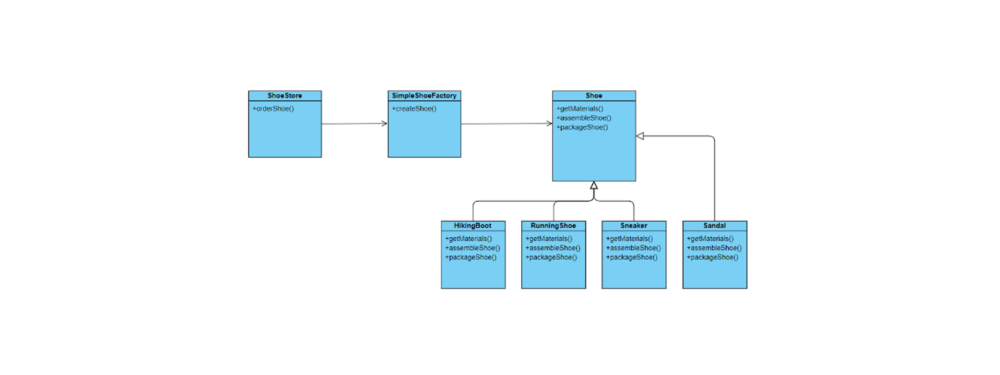
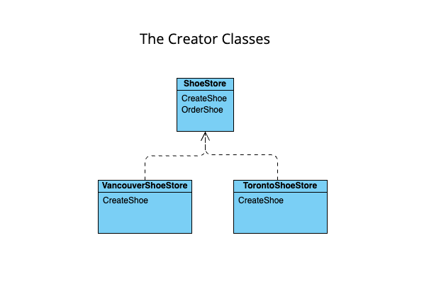
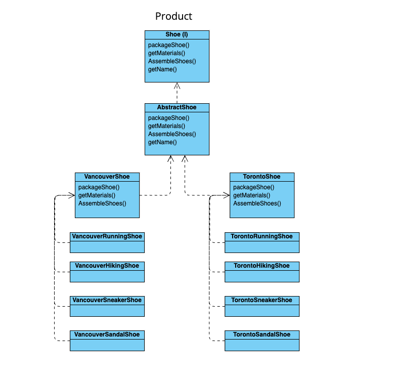
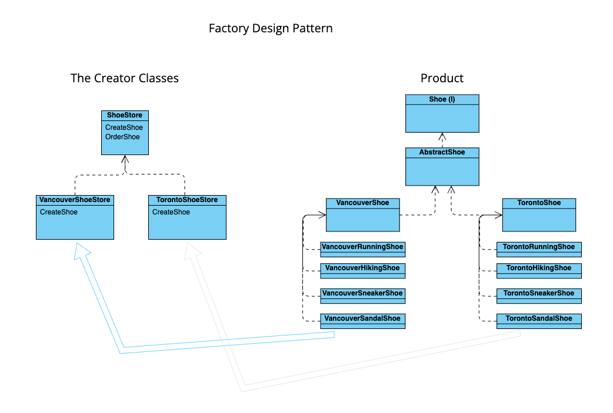

### Introduction: What is the Factory Method and Why Do We Use It?

The factory method is a creational design pattern used to create concrete implementations of a common interface. It separates the process of creating an object from the code that depends on the interface of the object.[1] Essentially, a factory method, or factory method pattern assigns object creation to an interface or abstract class and then we let the subclasses determine which class to instantiate.

Up to this point, we have been instantiating concrete classes using the new operator. This has been sufficient up to this point in our learning, but it can lead to our code becoming fragile and less flexible. For example, let’s say we operate a factory, JJX Manufacturing, that manufactures shoes. There are some general methods that go into manufacturing a shoe; we need to get the materials, assemble the shoe and lastly package a pair of shoes for shipping.

```
Shoe orderShoe(){
  Shoe shoe = new Shoe();
  
  shoe.getMaterials();
  shoe.assembleShoe();
  shoe.packageShoe();
  
  return shoe;
}
```

This method provides us the ability to order a general shoe, but we want our shoe manufacturing company to stand out and cannot simply sell one type of shoe. Shoes come in a variety of different styles like runners, sneakers, boots, sandals, etc. Furthermore, since the manufacturing process is generally the same, we would want to have our general Shoe as an abstract class or interface. If we wanted update our code to indicate what type of shoe we needed to produce to fill an order, it might look something like this: 

```
Shoe orderShoe(String style){
  Shoe shoe;
  
  if (shoeType.equals("hiker")){
    shoe = new HikingBoot();
  }
  else if (shoeType.equals("runner")){
    shoe = new RunningShoe();
  }
  else if (shoeType.equals("casual")){
    shoe = new Sneaker();
  }
  else if (shoeType.equals("summer")){
    shoe = new Sandal();
  }
  
  shoe.getMaterials();
  shoe.assembleShoe();
  shoe.packageShoe();
  
  return shoe;
}
```

In this example, we have several concrete classes being instantiated, with the decision of which class to instantiate being made at runtime depending on which conditions are met.[2] Although this might accomplish the task we need it to, when it comes time to make changes or adding to our code it will become more difficult as we will have to update this conditional check every time. This violates our Open/Close and Single Responsibility principles. To address this, we can remove the need for a complicated conditional structure to determine which class to instantiate, with an approach that delegates that decision to a separate component that creates the concrete object.[1] Simply put, let’s look at what varies within our code and encapsulate it.

### Designing A Simple Factory (SimpleFactoryMethod Package)

If we were to take our conditional statement out of the orderShoe() method and place that in its own object (ShoeFactory), this object would be considered our “factory”. Addressing our issue with our classes having more than one purpose, our factory class now strictly deals with object creation. As a result our orderShoe() method becomes a client of our ShoeFactory class. Whenever we need to fill a shoe order, we call upon our factory to make it. This method only cares that it gets a shoe that implements the general Shoe interface, so it can call our manufacturing methods.[2] 

```
package SimpleFactoryMethod;

/**
 * A class representation of a simple shoe factory. The factory determines which shoe subclass gets
 * called when an order is placed at a shoe store
 */
public class SimpleShoeFactory {

  /**
   * Creates a specific shoe subclass depending on the style being ordered by a client
   * @param style The style of shoe to create
   * @return the shoe type to create
   */
  public Shoe createShoe(ShoeStyle style){
    Shoe shoe = null;
    if (style.equals(ShoeStyle.HIKING)){
      shoe = new HikingBoot();
    }
    else if (style.equals(ShoeStyle.RUNNER)){
      shoe = new RunningShoe();
    }
    else if (style.equals(ShoeStyle.CASUAL)){
      shoe = new Sneaker();
    }
    else if (style.equals(ShoeStyle.SUMMER)){
      shoe = new Sandal();
    }
    return shoe;
  }
}
```

So what is the benefit of having this? In its current state, our code has one client (one class that utilizes the factory). However, let’s say we expanded our business to include a Delivery class, or we decided to open up multiple Store classes. Each of these would become a client of our ShoeFactory and since we encapsulated the manufacturing process into one class, we only have one place to make modifications.

The time has come for JJX Manufacturing to expand beyond our factory and open up our first store. Our client code for our store will look as follows:

```
package SimpleFactoryMethod;

/**
 * A basic class representation of a ShoeStore. The store is the client of the SimpleShoeFactory
 * which it takes as a parameter to determine which shoe will be made when an order is placed
 */
public class ShoeStore {

  private final SimpleShoeFactory factory;

  /**
   * The ShoeStore constructor. It is composed of a factory, the SimpleShoeFactory, which creates
   * a given type of shoe
   * @param factory The factory we call to create the shoe
   */
  public ShoeStore(SimpleShoeFactory factory){
    this.factory = factory;
  }

  /**
   * A method to fill a shoe order. Calls our factory to determine the shoe subclass to call,
   * retrieves shoe materials, assembles the shoe and packages it
   * @param style The style of shoe to create
   * @return The packaged shoe
   */
  public Shoe orderShoe(ShoeStyle style){
    Shoe shoe;

    shoe = factory.createShoe(style);
    shoe.getMaterials();
    shoe.assembleShoe();
    shoe.packageShoe();

    return shoe;
  }
}
```

#### Key Points About This Code
* To utilize our updated factory, we first give our store a reference to SimpleShoeFactory
* Our ShoeStore constructor then passes the factory as a parameter
* The orderShoe() method now uses the factory to create the shoe type subclass be passing on the type into the order
* As a result we can remove the need for the new operator with the createShoe() method from our factory

This Simple Factory that we have created here is not actually a fully fledged Design Pattern. It’s more commonly referred to as a **programming idiom**, which is a group of code fragments sharing an equivalent semantic role, which recurs frequently across software projects often expressing a special feature of a recurring construct in one or more programming languages or libraries.[3] Think of a Simple Factory as a stepping stone to building our Factory Method Design Pattern



#### Breaking Down the Diagram
* **ShoeStore:** is the client of the factory. ShoeStore goes through the SimpleShoeFactory to get instances of Shoe

* **SimpleShoeFactory:** This is the factory where we create shoes; this is the only part of our program that refers to Shoe classes

* **Shoe:** The product of our factory, which can be defined as a interface or abstract class that the subclasses can override the methods from

* **Shoe Classes:** These are the concrete products we produce. Each needs to implement the Shoe interface. This allows us to create them via our factory and then pass them along to our store

Good news! The JJX Manufacturing company has been so successful that we are now able to franchise. Demand has been rising across the country and as a result we are looking to add multiple factories across the country. As great as this is, this could pose a potential problem for our business. Although our business currently exists within Canada, we cannot treat all provinces we manufacture in the same. For example, our current location Vancouver has a very wet climate and our shoes require more waterproofing technology, versus a city like Toronto has colder winters and less rigorous terrain. Depending on where a store is located we might need to adapt how we manufacture our shoes, so how do we address this?

An easy solution to this problem would be to directly connect a ShoeStore with the designated regional factory.

```
VancouverShoeFactory vanShoeFactory = new VancouverShoeFactory();
ShoeStore vanShoeStore = new ShoeStore(vanShoeFactory);
vanShoeStore.orderShoe("Runner");

TorontoShoeFactory torShoeFactory = new TorontoShoeFactory();
ShoeStore torShoeStore = newShoeStore(torShoeFactory);
torShoeStore.orderShoe("Runner");
```

### Building a Factory Method (FactoryMethod Package)

Our first solution seemed to work in the general sense, but not only does our clientele in different regions desire different styles to their shoes, the factories also have different ways of assembling and packaging shoes. Maybe our Toronto factory is located beside a box manufacturer and it is easier to order boxes from them than make the boxes in house like our Vancouver factory.

Ultimately, what we want to do is keep the framework of tying the shoe store to the creation of the shoe, but allow for more flexibility for the different variables we have to consider.

The first obvious answer is to use abstraction for our shoe stores. This will allow us to generalize the shoe creation process, but then allow our store subclasses to have the flexibility to utilize their style for creating and selling shoes.

With all of this in mind, there should be a solution that we can implement in order to create a valid separation of concerns between our classes, giving the power to each location to personalize their products (materials  and processes) introducing a great level of flexibility in each region, but at the same time not affecting or modifying the way that we are producing our shoes as an abstraction. This problem has been faced by other companies, and they have solved this problem with the Factory design method. Why not take advantage of this and create a solution following their principles.

The first step to create this design pattern is to understand our factory as a separate entity of the product that we are creating (and from now on this part will be understood as the creator entity), therefore we need a creator class that could produce a product, and a product that could have any type of characteristic, without affecting the creator class per se. It means, the creator class will control what product to produce but the responsibility of developing the product will be 100% in charge of the product class itself, not the creator class.

This separation of concern is what gives the power to the factory design pattern, because the creator will not need to change if the product changes, and at the same time the product can be extended giving a major flexibility to the client.

We need to implement 2 types of classes, the creational class, and the product class. 

## How JJX implemented the Factory Design Pattern

As a company we have two principal markets to attend to, Vancouver and Toronto's market (for now, we could extend our services to other cities).  And as we know, people in these cities are looking for different types of processes and materials, therefore we should give to each one a personalized experienced according to their expectations (remember that Vancouver has a very wet climate and our shoes require more waterproofing technology, versus a city like Toronto has colder winters and less rigorous terrain).

Then, we implemented a ShoeStore Abstract (SSA) class that will be the blueprint for each new factory we would like to include. The single responsibility of these classes is to indicate which Shoe to create (not how the shoe is created per se). Then, we must implement an abstract method in the SSA class, which indicates that any subclass that extends the SSA will need to implement this method.




The following diagram, will give you an idea of the level of flexibility that we are giving to our shoes, a shoe produced by the Toronto section could be completed different that the one in Vancouver but still they have in common that they need to have a package, get materials, need to specify how the shoes are assembled and of course each shoe must have a name. This will be a great flexibility, but still they need to follow a protocol that as and abstraction will make them a Shoe.



Now, that we have a creational part and a product part we can expose our process (We expose our process, not our secrets), and here we are, the implementation that allow us to keep encapsulated our process and still provide the most flexible service to our clients, the JJX factory design pattern:




## How To use this code

Go to src/FactoryMethod/JJXTestDriver.java

And run the file, it will give you a basic idea on how, this  design pattern works.

As an example: 

````
    ShoeStore VcStore = new VancouverShoeStore();
    ShoeStore TrStore = new TorontoShoeStore();

    Shoe example = VcStore.orderShoe(ShoeStyle.RUNNER);
    System.out.println("\nJing Ordered " + example.getName() + "\n");

    Shoe example2 = TrStore.orderShoe(ShoeStyle.HIKING);
    System.out.println("\nJordan Ordered " + example2.getName() + "\n");
````

will output :

````

Getting waterproofing materials
Collecting and cutting Materials
Assembling your Shoes. While we wish to be at whistler! Still we love you
Packing your shoes. I hope it is ready before it starts to rain... sorry, too late

Jing Ordered Vancouver Running Shoe - The Stanley

Getting warmer Materials
Collecting and cutting Materials
Assembling your Shoes, while the Toronto Raptors are playing!
Packing with hot Cocoa love, cause Its a Toronto Winter Night.

Jordan Ordered Toronto Hiking Boot - The Niagara

````
## References

[1] I. Rodriguez, “The factory method pattern and its implementation in Python,” Real Python, 07-Apr-2022. [Online]. Available: https://realpython.com/factory-method-python/#:~:text=Factory%20Method%20is%20a%20creational,interface%20to%20perform%20its%20tasks. [Accessed: 06-Nov-2022]. 

[2] E. Freeman, E. Robson, B. Bates, and K. Sierra, “Chapter 4. Baking with OO Goodness: The Factory Pattern,” in Head first design patterns: Building extensible and maintainable object-oriented software, Beijing: O'Reilly, 2021. 

[3] “Programming idiom,” Wikipedia, 20-Aug-2022. [Online]. Available: https://en.wikipedia.org/wiki/Programming_idiom. [Accessed: 09-Nov-2022]. 
